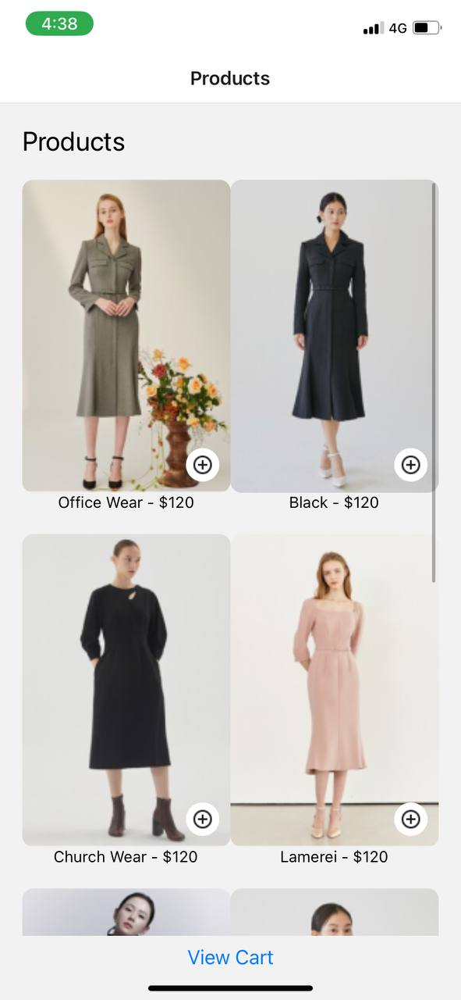
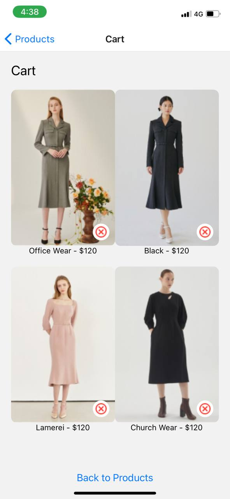

11062301
Assignment6

# Shopping Cart App

This React Native application displays a list of products and allows users to add items to their cart and view them. It uses Expo for ease of development and testing.

## Design Choices

### UI Layout
1. Grid Layout for Products: 
   - Products are displayed in a grid layout using a FlatList with numColumns set to 2. This layout allows users to view multiple products side by side, providing a visually appealing and efficient browsing experience.

2. Overlay Add Button: 
   - An "Add to Cart" button is overlaid on each product image at the bottom-right corner. This ensures the button is easily accessible while keeping the design clean and unobtrusive.

3. Styling: 
   - Simple and clean styles are used to make the app look modern and user-friendly. The use of margins, padding, and flex properties ensures a responsive layout.

### Data Storage
1. AsyncStorage:
   - AsyncStorage is used for storing cart items locally on the device. This allows for persistence across app sessions, ensuring that users' selections are saved even if the app is closed and reopened.

## Implementation

### Components

#### HomeScreen.js
Displays the list of products and includes functionality to add items to the cart.
#### CartScreen.js
Displays the items added to the cart.

### Screenshots

#### Home Screen

#### Cart Screen
